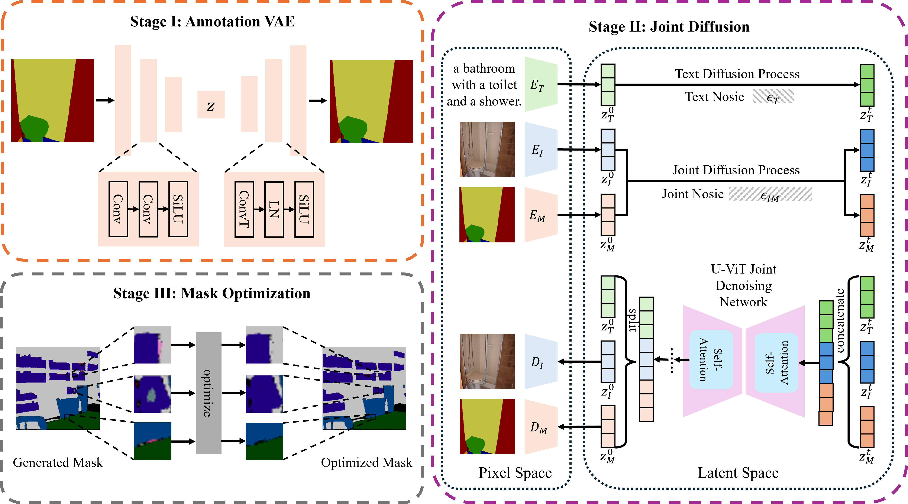

# 🎏 JoDiffusion: Jointly Diffusing Image with Pixel-Level Annotations for Semantic Segmentation Promotion

<div align="center">

[](https://arxiv.org/abs/2512.13014)
[](https://huggingface.co/0why0/JoDiffusion)

**AAAI 2026 Accepted Paper**

[**Haoyu Wang**](https://haoyuwang.com), [**Lei Zhang**](https://teacher.nwpu.edu.cn/nwpuzhanglei.html), [**Wenrui Liu**](#), [**Dengyang Jiang**](https://vvvvvjdy.github.io/), [**Wei Wei**](https://teacher.nwpu.edu.cn/weiwei.html), [**Chen Ding**](https://gr.xupt.edu.cn/info/1213/7446.htm)

<a href="#news">News</a> •
<a href="#installation">Installation</a> •
<a href="#data-prep">Data Prep</a> •
<a href="#getting-started">Getting Started</a> •
<a href="#training">Training</a> •
<a href="#inference">Inference</a> •
<a href="#acknowledgements">Acknowledgements</a> •
<a href="#citation">Citation</a>

</div>

---

<p align="center">

</p>

## 📖 Introduction
**JoDiffusion** is a novel framework for semantic segmentation promotion by jointly diffusing images with pixel-level annotations. By leveraging the power of diffusion models, JoDiffusion achieves state-of-the-art results on standard benchmarks.

> **Abstract:** *Given the inherently costly and time-intensive nature of pixel-level annotation, the generation of synthetic datasets comprising sufficiently diverse synthetic images paired with ground-truth pixel-level annotations has garnered increasing attention recently for training high-performance semantic segmentation models. However, existing methods necessitate to either predict pseudo annotations after image generation or generate images conditioned on manual annotation masks, which incurs image-annotation semantic inconsistency or scalability problem. To migrate both problems with one stone, we present a novel dataset generative diffusion framework for semantic segmentation, termed JoDiffusion. Firstly, given a standard latent diffusion model, JoDiffusion incorporates an independent annotation variational auto-encoder (VAE) network to map annotation masks into the latent space shared by images. Then, the diffusion model is tailored to capture the joint distribution of each image and its annotation mask conditioned on a text prompt. By doing these, JoDiffusion enables simultaneously generating paired images and semantically consistent annotation masks solely conditioned on text prompts, thereby demonstrating superior scalability. Additionally, a mask optimization strategy is developed to mitigate the annotation noise produced during generation. Experiments on Pascal VOC, COCO, and ADE20K datasets show that the annotated dataset generated by JoDiffusion yields substantial performance improvements in semantic segmentation compared to existing methods.*

<span id="news"></span>
## 🔥 News

* **[2025-12]** 🔥 Code and pre-trained weights are released!
* **[2025-11]** 🎉 Our paper has been accepted by **AAAI 2026**!

<span id="installation"></span>
## 🛠 Installation

We recommend using Anaconda to manage the environment.

```bash
conda create -n jodiffusion python=3.11 -y
conda activate jodiffusion
pip install -r requirements.txt
```

<span id="data-prep"></span>
## 📂 Dataset Preparation

### 1. Download Datasets
Please download the datasets and organize them following the [MMSegmentation Dataset Preparation](https://github.com/open-mmlab/mmsegmentation/blob/main/docs/en/user_guides/2_dataset_prepare.md) guide.

* **ADE20K & Pascal VOC Aug**: Follow the standard MMSegmentation structure.
* **COCO**: Download from the [official website](https://cocodataset.org/#download).

### 2. Preprocessing
Convert COCO to a semantic segmentation format and generate captions for the datasets:

```bash
# Convert COCO to semantic segmentation format
python utils/prepare_coco_semantic_80.py

# Generate captions (using BLIP-2)
python utils/prepare_ade20k_blip2_captions.py
python utils/prepare_voc_blip2_captions.py
```

### 3. Configuration
Update the `data_root` path in your dataset configuration file (e.g., `dataset/xxx_semantic.py`) to point to your local dataset directory.

<span id="getting-started"></span>
## 🚀 Getting Started

### Weight Initialization
Before training, run the following script to adjust the pre-trained model weights to fit the label input dimensions:

```bash
python inference/jodiffusion.py
```

<span id="training"></span>
## 🏋️ Training

### Stage 1: Training Label VAE
Train the Variational Autoencoder (VAE) for label compression.

```bash
# Example: Training on ADE20K
bash scripts/ae/ade20k_light.sh
```
> **Note:** You can modify `scripts/ae/xx_light.sh` to adjust hyperparameters like batch size, learning rate, and epochs.
>
> 💾 **Pre-trained Weights:** We provide trained VAE weights for three datasets. Download them [here](https://huggingface.co/0why0/JoDiffusion/tree/main).

### Stage 2: Training JoDiffusion
Train the joint diffusion model using the pre-trained Label VAE.

```bash
bash scripts/ldm/ade20k_light_joint_5e5.sh
```
> 💾 **Pre-trained Weights:** Pre-trained JoDiffusion weights are also available [here](https://huggingface.co/0why0/JoDiffusion/tree/main).

<span id="inference"></span>
## 🎨 Inference & Evaluation

### 1. Generating Images
Generate synthetic images and masks for downstream task evaluation:

```bash
bash scripts/gen/ade20k_light.sh
```

### 2. Optimizing Masks
Refine the generated masks using our optimization script:

```bash
bash scripts/optim/ade20k_light.sh
```

### 3. Downstream Evaluation
We use [MMSegmentation](https://github.com/open-mmlab/mmsegmentation) to train downstream segmentation models (e.g., Mask2Former, DeepLabV3+) using the generated synthetic data. Please refer to the MMSegmentation docs for training commands.

<span id="acknowledgements"></span>
## 🔗 Acknowledgements

This repository is built upon the amazing work of:
* [Diffusers](https://github.com/huggingface/diffusers)
* [MMSegmentation](https://github.com/open-mmlab/mmsegmentation)

<span id="citation"></span>
## 🖊️ Citation

If you find this code useful for your research, please consider citing our paper:

```bibtex
@article{wang2025jodiffusion,
  title={JoDiffusion: Jointly Diffusing Image with Pixel-Level Annotations for Semantic Segmentation Promotion},
  author={Wang, Haoyu and Zhang, Lei and Liu, Wenrui and Jiang, Dengyang and Wei, Wei and Ding, Chen},
  journal={Proceedings of the AAAI Conference on Artificial Intelligence},
  year={2026}
}
```
